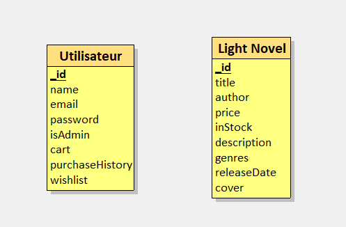
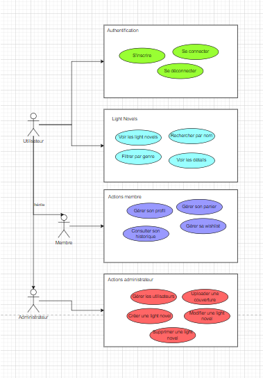

<h1 align="center">
    <br>
    
    <br>
    Novelya
    <br>
</h1>

<h4 align="center">
    Situation professionnelle n°2 pour l'épreuve E6 (BTS SIO)
</h4>

<p align="center">
    <em>Application e-commerce de vente de Light Novels</em>
</p>

<p align="center">
    Plateforme complète permettant de découvrir, rechercher et acheter des Light Novels. 
    Gestion d'utilisateurs avec authentification JWT, panier d'achat, historique et liste de souhaits.
</p>

<p align="center">
  <a href="#fonctionnalités">Fonctionnalités</a> •
  <a href="#installation-et-démarrage">Installation et démarrage</a> •
  <a href="#architecture">Architecture</a> •
  <a href="#stack-technique">Stack technique</a> •
  <a href="#documentation">Documentation</a> •
  <a href="#api-endpoints">API Endpoints</a>
</p>

---

## Fonctionnalités

- **Authentification JWT** : Inscription et connexion sécurisées avec tokens JWT stockés dans des cookies
- **Catalogue de Light Novels** : Parcourir les oeuvres avec filtres par genre (action, romance, fantasy, etc.)
- **Recherche avancée** : Trouver des Light Novels par nom ou mots-clés
- **Panier d'achat** : Ajouter, modifier ou supprimer des articles du panier
- **Historique d'achats** : Consulter les achats précédents
- **Liste de souhaits** : Sauvegarder des Light Novels pour plus tard
- **Panel administrateur** : CRUD complet des Light Novels (création, modification, suppression)
- **Upload d'images** : Téléchargement de couvertures pour les Light Novels
- **Design responsive** : Interface adaptée à tous les écrans

---

## Installation et démarrage

### Prérequis

- Docker et Docker Compose installés

### Démarrage rapide

```bash
# Cloner le projet
git clone https://github.com/UnOrdinary95/sio-Novelya.git
cd sio-Novelya
cp .env.example .env
docker compose up --build -d # Lance en arrière-plan
```

### Commandes utiles

```bash
# Pour arrêter
docker compose down

# Pour arrêter et supprimer les données (volume)
docker compose down -v
```

### Accès après démarrage

- **Frontend** : http://localhost:4200
- **API** : http://localhost:3000
- **Documentation API** : http://localhost:3000/docs

---

## Architecture

Le projet utilise une architecture **monorepo** avec pnpm workspaces :

```
sio-Novelya/
├── apps/
│   ├── frontend/          # Application Angular (port 4200)
│   │   └── Nginx (production)
│   └── backend/           # API Express.js (port 3000)
├── docker/                # Configurations Docker
│   └── jeu-essai/         # Scripts d'initialisation MongoDB
├── docker-compose.yaml    # Orchestration des services
└── package.json           # Configuration pnpm workspace
```

**Services Docker :**

- **frontend** : Nginx servant l'application Angular
- **backend** : API Node.js/Express
- **db** : MongoDB 8 avec initialisation automatique

**Flux de données :**

1. L'utilisateur interagit avec le frontend Angular
2. Les requêtes API sont envoyées au backend Express
3. Le backend communique avec MongoDB pour persister les données
4. Les réponses sont renvoyées au frontend

---

## Stack technique

### Frontend

- **Framework** : Angular 21.0.3
- **Langage** : TypeScript 5.9
- **Styling** : Tailwind CSS 4.1 + Spartan NG (composants)
- **Icônes** : ng-icons avec Lucide
- **Programmation réactive** : RxJS 7.8

### Backend

- **Runtime** : Node.js 20 (ES Modules)
- **Framework** : Express.js 5.1
- **Langage** : TypeScript 5.8
- **Base de données** : MongoDB 8 (driver natif)
- **Authentification** : JWT (jsonwebtoken) + bcrypt
- **Sécurité** : helmet, express-rate-limit, CORS
- **Upload fichiers** : multer
- **Documentation** : Swagger UI Express

### DevOps

- **Conteneurisation** : Docker + Docker Compose
- **Gestionnaire de paquets** : pnpm workspaces
- **Serveur web** : Nginx
- **Task runner** : Makefile

---

## API Endpoints

### Authentification

| Méthode | Endpoint    | Description                 |
| ------- | ----------- | --------------------------- |
| POST    | `/register` | Créer un compte utilisateur |
| POST    | `/login`    | Connexion utilisateur       |
| POST    | `/logout`   | Déconnexion utilisateur     |

### Utilisateurs

| Méthode | Endpoint              | Description                      | Auth |
| ------- | --------------------- | -------------------------------- | ---- |
| GET     | `/users/me`           | Profil de l'utilisateur connecté | ✓    |
| GET     | `/users`              | Liste de tous les utilisateurs   | ✓    |
| GET     | `/users/:id`          | Détails d'un utilisateur         | ✓    |
| PUT     | `/users/:id`          | Mettre à jour un utilisateur     | ✓    |
| PATCH   | `/users/:id/cart`     | Modifier le panier               | ✓    |
| PATCH   | `/users/:id/history`  | Modifier l'historique            | ✓    |
| PATCH   | `/users/:id/wishlist` | Modifier la liste de souhaits    | ✓    |
| DELETE  | `/users/:id`          | Supprimer un utilisateur         | ✓    |

### Light Novels

| Méthode | Endpoint                    | Description                  | Auth |
| ------- | --------------------------- | ---------------------------- | ---- |
| GET     | `/lightnovels`              | Liste des Light Novels       |      |
| GET     | `/lightnovels/search/:name` | Recherche par nom            |      |
| GET     | `/lightnovels/genre/:genre` | Filtrer par genre            |      |
| GET     | `/lightnovels/:id`          | Détails d'un Light Novel     |      |
| POST    | `/lightnovels`              | Créer un Light Novel         | ✓    |
| PUT     | `/lightnovels/:id`          | Mettre à jour un Light Novel | ✓    |
| PATCH   | `/lightnovels/:id/cover`    | Upload une couverture        | ✓    |
| DELETE  | `/lightnovels/:id`          | Supprimer un Light Novel     | ✓    |

**Légende :** ✓ = Authentification requise

---

## Documentation

### Schéma MongoDB

<p align="center">
  
</p>

Le schéma de la base de données comprend deux collections principales :

- **Utilisateur** : Stocke les informations des utilisateurs (nom, email, mot de passe), le statut administrateur, le panier, l'historique d'achats et la liste de souhaits
- **Light Novel** : Contient les données des oeuvres (titre, auteur, prix, stock, description, genres, date de sortie et couverture)

### Diagramme de cas d'utilisation

<p align="center">
  
</p>

Le système distingue trois types d'acteurs avec des niveaux de permissions différents :

**Utilisateur (non connecté)** :

- S'inscrire / Se connecter
- Voir les Light Novels
- Rechercher par nom
- Filtrer par genre
- Voir les détails d'une oeuvre

**Membre (utilisateur connecté)** :

- Toutes les actions utilisateur
- Gérer son profil
- Gérer son panier
- Consulter son historique
- Gérer sa wishlist

**Administrateur** :

- Toutes les actions membre
- Gérer les utilisateurs
- Créer / Modifier / Supprimer un Light Novel
- Uploader des couvertures

---

## Configuration environnement

Copier le fichier `.env.example` vers `.env` :

```bash
cp .env.example .env
```

Les variables sont pré-configurées pour fonctionner avec Docker. Modifiez-les si nécessaire.

---

<p align="center">
    <strong>Novelya</strong> — Projet BTS SIO SLAM
</p>
